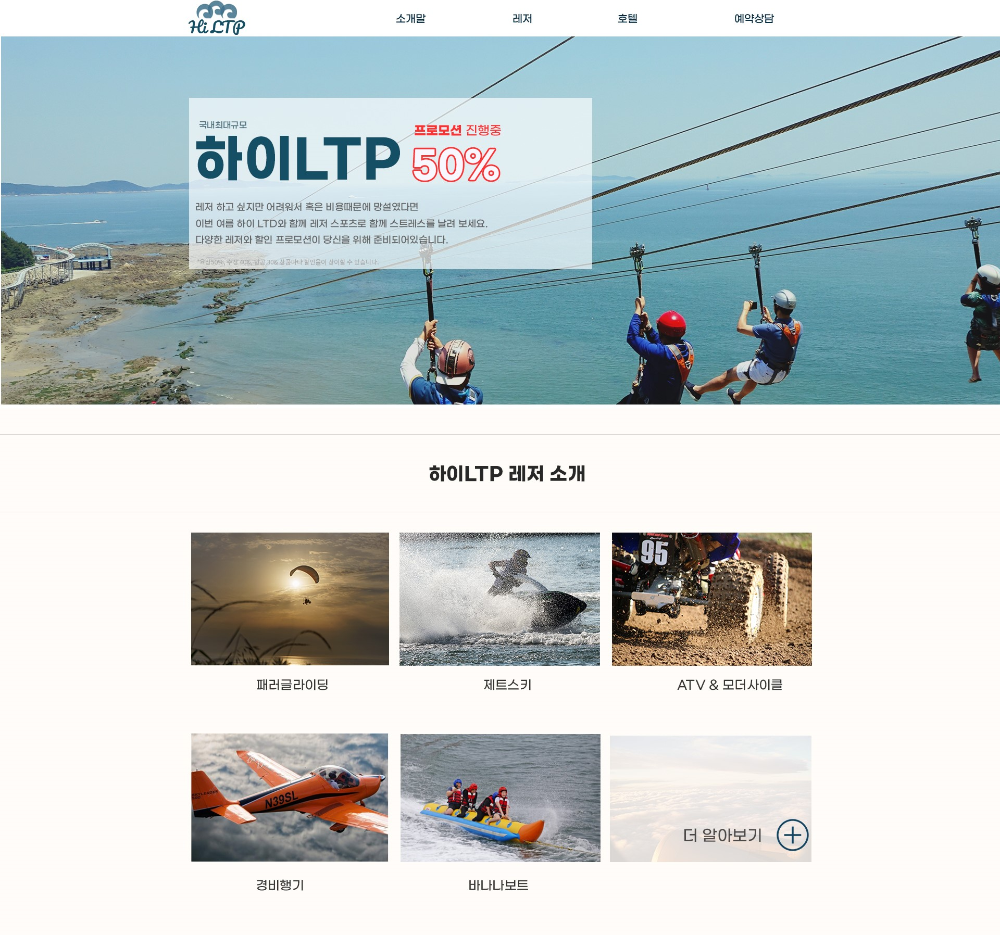
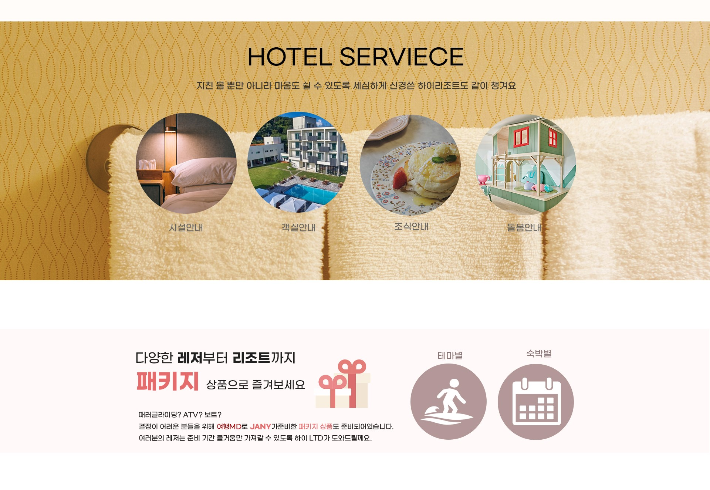

# 프론트엔드 프로젝트 “meta-tony-test 1.0”

 | 
--|--|

 | 
--|--|

- [🌐 사이트 바로가기](https://tony96kimsh.github.io/tony96kimsh/01_mtt/portfolio.html)
> 

사용 언어 및 툴

- JavaScript( jQuery, React )
- HTML, CSS
- photoshop, illustration
- QA 실무(1년 8개월) - JIRA. Figma, Slack, Excel, Swagger(JSON)

 

## 영동군청 카피 (라이브러리 없이 jQuery 사용)

 | 
--|--|

링크

- [🌐 사이트 바로가기](https://tony96kimsh.github.io/tony96kimsh/01_mtt/list/yd)

기술 스택

- jQuery, HTML, CSS

프로젝트 개요

- 다른 라이브러리 jQuery만 사용하여 카피한 프로젝트입니다.

주요 기능 

- 4단 반응형 구현
- 슬라이드 및 아이콘 루프 애니메이션 구현
- 날씨 위젯 및 날짜 메소드 사용

 

## KB은행 카피 (라이브러리 없이 jQuery 사용)

 |  | 
--|--|--|

링크

- [🌐 사이트 바로가기](https://tony96kimsh.github.io/tony96kimsh/01_mtt/list/kb)

기술 스택

- jQuery, HTML, CSS

프로젝트 개요

- 다른 라이브러리 jQuery만 사용하여 카피한 프로젝트입니다.

주요 기능 

- PC, Mobile 반응형(적응형) 사이트 제작
- 슬라이드 및 애니메이션 구현
- 스크롤에 따른 반응 구현

 

# 디자인 및 퍼블리싱

## 대성 홀딩스 (리뉴얼 디자인 및 마크업)

 |  | 
--|--|--|

링크

- [🌐 사이트 바로가기](https://tony96kimsh.github.io/tony96kimsh/01_mtt/list/ds/index.html)

기술 스택

- HTML, CSS

프로젝트 개요

- 기존 대성 홀딩스 사이트를 리뉴얼 디자인하여 웹 표준으로 웹 사이트 제작

주요 기능 

- CSS를 통한 아코디언 요소를 구현
- 파비콘 구현

## 하이쥬 성형외과 (웹 사이트 디자인 및 마크업)

 |  | 
--|--|--|

링크

- [🌐 사이트 바로가기](https://tony96kimsh.github.io/tony96kimsh/01_mtt/list/hj)

기술 스택

- HTML, CSS

프로젝트 개요

- 성형외과의 사용자 니즈에 맞춘 트랜디한 계절감을 살린 웹 사이트 디자인 및 웹 표준 제작

주요 기능 

- CSS를 통한 슬라이드 UI 구현
- 파비콘 로고 구현

## Hello! Langth (화상영어 앱 디자인)

|
 --|--|

|
--|--|

링크

- [🌐 사이트 바로가기](https://tony96kimsh.github.io/tony96kimsh/01_mtt/list/wd-1.html)

기술 스택

- photoshop,  Illustrator

프로젝트 개요

- 모바일 화상 영어 교육 디자인

## (팀 프로젝트 / 디자인담당) 반려식물 관리 앱 “목요일”

|
--|--|

||
--|--|--|

링크

- [🌐 사이트 바로가기](https://tony96kimsh.github.io/tony96kimsh/01_mtt/list/wd-2.html)

기술 스택

- photoshop,  Illustrator

프로젝트 개요

- 반려 식물 가이드 모바일 어플리케이션 디자인 팀 프로젝트

- 디자인 총관 담당

## 가구 쇼핑몰 반응형 웹 디자인 “HI FURNITURE”

|
--|--|
|

링크

- [🌐 사이트 바로가기](https://tony96kimsh.github.io/tony96kimsh/01_mtt/list/wd-4.html)

기술 스택

- photoshop

프로젝트 개요

- 모바일/PC 가구 쇼핑몰  웹 사이트 디자인

## 스포츠 레저 PC 웹 디자인 “HT LTP”

|
--|--|
|

링크

- [🌐 사이트 바로가기](https://tony96kimsh.github.io/tony96kimsh/01_mtt/list/wd-4.html)

기술 스택

- photoshop

프로젝트 개요

- 스포츠 레저 사이트 디자인

# QA 업무 및 협업 경험

## QA업무 **23.05 - 24.01 (1년 8개월)**

||
--|--|--|

## RFID 재고 시스템 관리 “ZARAHOME”

||
--|--|--|

## **경력**

- 테스트이앤씨 - 카카오모빌리티 트럭커 파트너사 QA 업무(**1년 8개월**; 2023.05 ~ 2025.01)
- 자라홈리테일코리아 - RFID 재고 시스템 관리 (**3년 2개월**; 2019. 01 ~ 2022. 02)

# 교육 이수 및 자격증

## 교육 이수

- Node.js 풀스택 개발자 양성 과정(한국SW기술진흥협회(KOSTA) 2025.2 - 2025.07)
- 프론트엔드 리액트(강남 이젠아카데미 22.09 - 22.12)
- 바닐라 자바스크립트(강남 이젠아카데미  22.09 - 22.12)
- 스마트UI/UX 웹디자인 & 웹퍼블리셔-프론트엔드(구로 하이미디어 2022. 03 - 2022. 09)

## 자격증

- ISTQB CTFL (Certified Tester Foundaton Level) - 2024.4.25

# 전공이력

- 교동초등학교 졸업
- 칠곡중학교 졸업
- 강북고등학교 이공계 졸업(2012.03 ~ 2014.12)
- 한국폴리텍 패션디자인과  1학년 중퇴 (2015.03 ~ 2015.07)
- 한국방송통신대 컴퓨터과학과 3학년 재학 중 (2023.03 ~ 현재)

# Contact

|👤 **김성훈** (96.03.26) 📞 010-9626-6393 ✉️ tony96kimsh@gmail.com 🌐 [포트폴리오](./portfolio.md)
--|--|

> **“동료의 성장은 곧 나의 성장”**  
> 협업을 통해 함께 성장하는 개발자가 되겠습니다.