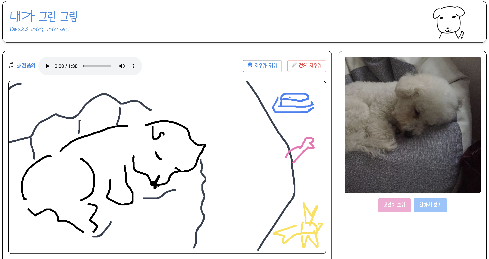
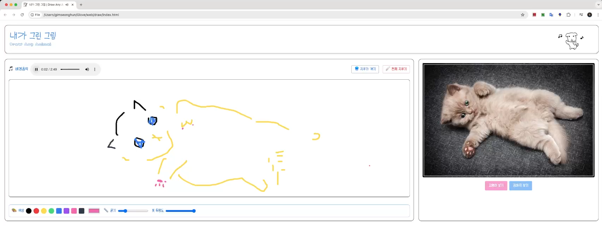
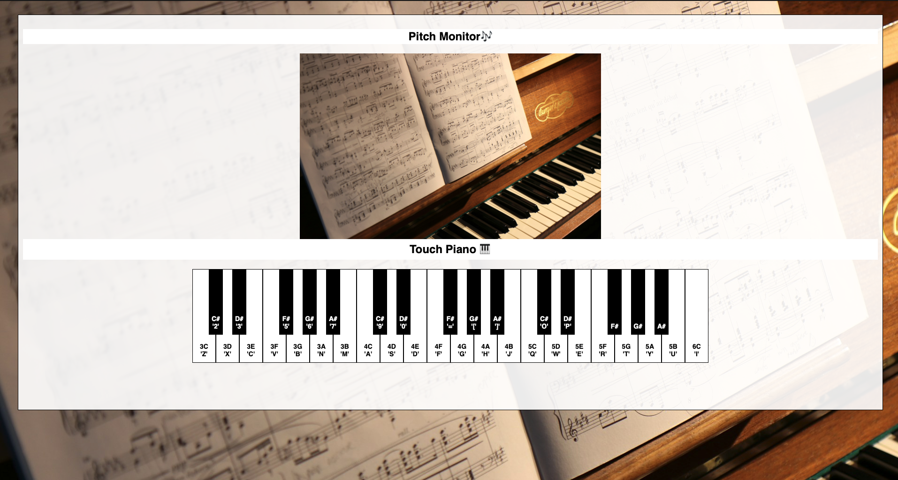

## 내가 그린 그림 (그림판 웹앱)

 | 
--|--|

링크

- 🧑‍💻 [깃허브 코드 및 설명](https://github.com/tony96kimsh/DrawAnyAnimal)
- [🌐 사이트 바로가기](https://tony96kimsh.github.io/DrawAnyAnimal)

기술 스택

- JavaScript (Canvas API, Audio API, Fetch API)
- Tailwind CSS

프로젝트 개요

- 설치 없이 누구나 쉽게 사용 가능한 웹 기반 그림판 어플리케이션
- 귀엽고 깔끔한 디자인과 밝은 배경음악으로 친근한 분위기 제공
- 강아지와 고양이 사진 API를 통해 특색있는 그림판 앱 제공

주요 기능

1. canvas API를 통한 그림판 기능
    -   붓 색상, 굵기, 투명도, 지우개 기능 제공
2. 고양이, 강아지 API를 통해 다양한 참고 동물 사진 제공
3. Audio API를 통한 배경음악 기능 제공

 

## 성훈의 방명록 (그룹 스터디 및 개인 프로젝트)

 | 
--|--|

링크

- [🧑‍💻 깃허브 코드 및 설명](https://github.com/tony96kimsh/muffler)
- [🌐 사이트 바로가기](https://muffler.onrender.com/)

기술 스택

- 백엔드: Node.JS, Express, Axios
- 프론트엔드: EJS
- 호스팅: Render

프로젝트 개요

- 5주간의 node.js 그룹 스터디와 마지막 6주차 개별 프로젝트 제작으로 진행하였습니다.
- 개인 프로젝트는 “성훈의 방명록”은 클라우드 DB와 Node.js를 사용한 방명록 사이트입니다.

주요 기능

- **글 남기기 & 삭제 기능** (실시간 반영)
- **JSONBin을 이용한 외부 DB-like 저장**
- **EJS 기반 템플릿 구성**으로 깔끔한 UI 구성
- **Axios로 RESTful API 연동** 및 JSON 처리
- **Render를 통한 서버 배포 & 접근 가능 웹서비스 구성**

 

## 📚 PhilPick (알라딘 Open API 도서 검색 웹 앱)

 | 
--|--|

링크

- 🧑‍💻 [깃허브 코드 및 설명](https://github.com/tony96kimsh/philpick)
- [🌐 사이트 바로가기](https://philpick.vercel.app/)

기술 스택

- Frontend:  HTML, JavaScript, Tailwind CSS
- Backend: Open API 활용(알라딘 서재 Open API)
- Deployment: Vercel 서버리스 배포

프로젝트 개요

- 글자를 사랑하는 사람들에게 **'심플하고 깊이 있는'** 책 검색 경험 제공한다는 철학의 서점 사이트를 구현하고 싶었습니다.
- 단순하고 직관적인 검색 환경을 제공하고 싶어 한 페이지 내에서 검색어 입력과 결과 확인까지 가능한 심플한 도서 검색 앱을 제작하게 되었습니다. 또한, Open API 활용 능력을 실전에 적용해 보고 싶었던 것도 주요 동기 중 하나였습니다.

주요 기능 

- 사용자가 검색어를 입력하면, **알라딘 API를 통해 도서 목록을 실시간으로 받아와 화면에 렌더링**
- 검색 결과는 **카드 형태로 깔끔하게 시각화** (책 제목, 저자, 가격, 썸네일 등 표시)
- **Tailwind CSS로 다크모드 및 반응형 UI 구현**
- 향후 API 확장 및 즐겨찾기 기능 추가 가능성을 고려하여 **모듈화된 구조**로 설계

 

## Effy Sound (브라우저로 간편하게 어디서나 피아노 연주)

링크

- [🧑‍💻 깃허브 코드 및 설명](https://github.com/tony96kimsh/piano)
- [🌐 사이트 바로가기](https://tony96kimsh.github.io/piano/)

기술 스택

- Javascript, HTML, CSS

프로젝트 개요

- 간단하게 악보를 읽을 때 피아노 어플을 사용하였는데, 건반 사이즈가 작아서 사용에 불편함이 있었고, 
취미로 목소리의 음정을 알고 싶을 때, pitch monitor(음 시각화) 앱을 사용하였는데 피아노 어플과 같이 쓸 수 없어서 불편하여 새로운 웹앱을 만들기로 결심했습니다.

**주요 기능**

- 클릭으로 연주 가능한 피아노 웹 사이트
- 키보드 단축키 사용 가능

 

## **한국잉! 영어 사전** (App Inventor를 통한 개발)

링크

- [Github](https://github.com/tony96kimsh/quad-dictionary)

기술 스택

- App Inventer, Open API(XML)

프로젝트 개요

- 영어사전으로 공부하는 한국인을 위한 앱으로 심플한 디자인과 한영, 국어 그리고 영어 사전을 페이지 전환없이 손쉽게 사용할 수 있는 사전입니다.
- 이름의 뜻은 한영사전, 국어사전, 영어사전 첫글자를 따서 한국잉 영어사전으로 정했습니다.

**핵심 기능**

- **검색어 입력 후 원하는 사전 선택 → 하단 웹뷰에서 바로 검색**
- **검색어 없이도** 사전 버튼 클릭 시 해당 사이트로 이동
- **상단 검색바 접기 기능**으로 검색 결과 집중 가능 (자동 접힘 지원)

**추후 계획 ([To Be](https://www.notion.so/4dict-project-log-19ef398452c380839fe7cf02bb646bb1?pvs=21))**

- 앱 인벤터의 웹뷰 제한으로 직접 URL 링크 사용 불가.
- 기존 사전 API는 유료/저작권 문제 → **Glosbe Open API + 한국어 기초사전 JSON 활용**
- 직접 사전 웹사이트 제작 후 앱과 연결 예정 (25.02.20~)
- Open AI를 활용한 개인화된 단어 설명 기능 추가 예정(25.02.21~)