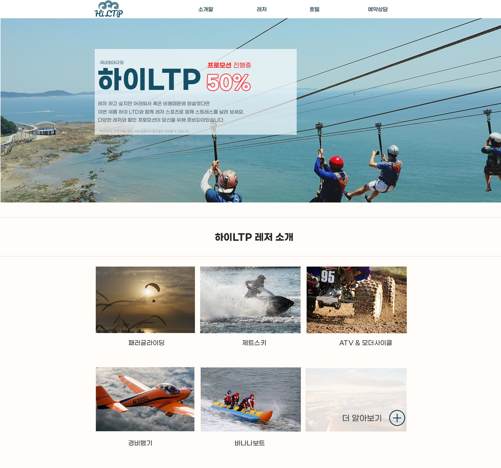
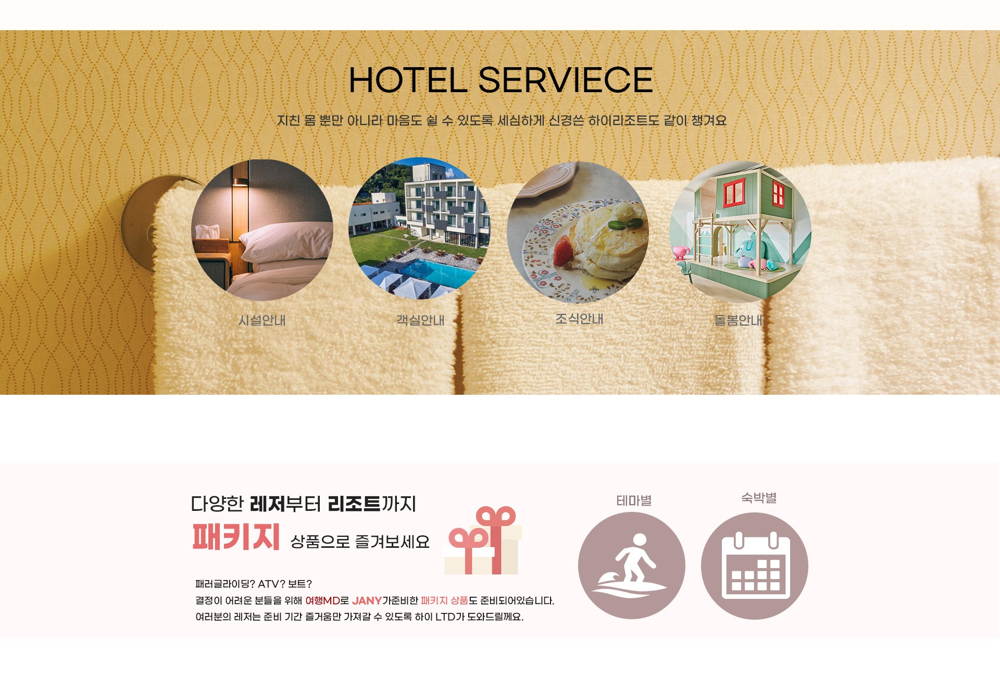
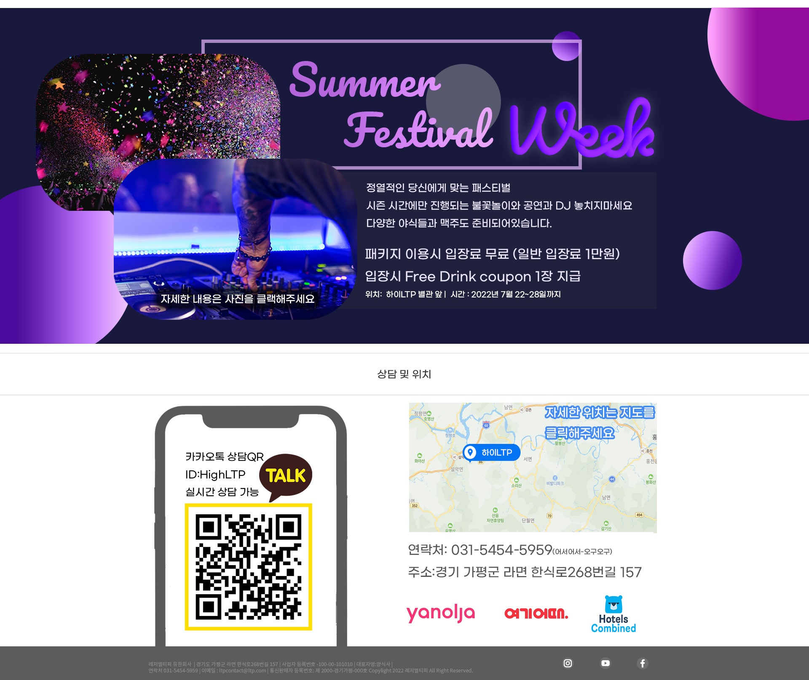

# 디자인부터 QA, 프론트엔드, 백엔드까지 경험한 개발자 김성훈입니다.

# 목차

1. [이력서(외부 페이지)](./CV.md)
2. [자기소개](#자기소개)
3. [기술 스택](#기술스택)
4. [풀스택 개발](#풀스택-프로젝트-glove-project)
5. [프론트엔드 개발](#프론트엔드-프로젝트-meta-tony-test-10)
6. [디자인 및 퍼블리싱](#디자인-및-퍼블리싱)
7. [QA 업무 및 협업 경험](#qa-업무-및-협업-경험)
8. [교육 이수 및 자격증](#교육-이수-및-자격증)
9. [전공 이력](#전공이력)
10. [Contact](#contact)

# 자기소개

패션 브랜드 자라홈에서 3년간 매장 관리직으로 근무하며 빠르게 변화하는 SPA 매장의 특성상, 계획적인 운영과 원활한 커뮤니케이션 역량을 쌓았습니다. 특히, 재고 관리를 위한 **RFID 시스템 도입을 주도하면서 IT 기술이 업무 효율성과 연결되는 경험을 하였고**, 이를 계기로 자연스럽게 개발에 대한 관심을 갖게 되었습니다.

이후 QA 업무를 맡으며 1년 8개월간 다양한 테스트 환경을 경험했고, ISTQB CTFL 자격증을 취득하며 **체계적인 검증 방식과 애자일 개발 프로세스**에 대한 이해를 넓혔습니다.

개발자로서 복잡한 문제도 스스로 분석하고 해결해나가며, 상황에 따라 유연하게 학습하는 태도를 중요하게 생각합니다. 또한, **동료의 성장은 곧 나의 성장**이라는 신념을 바탕으로 지식을 공유하며 팀의 시너지를 이끌어내는 리더 개발자로 성장하고 싶습니다.

# 기술스택

☕️ Frontend
- **📐 Markup & Styling**  
   

- **⚛️ Framework / Library**  
 

🖥 Backend

- **⚙️ Runtime**  

- **🔗 API 연동 / 백엔드 통신**

🔤 Languages

- **🧱 절차형**  

- **🧩 객체지향**  
 

- **🐍 스크립트**  
 

🧰 Tools & Platforms

- **🧩 버전 관리 / 협업**  
   

- **🚀 배포 플랫폼**  
 

- 🎨 Design
  

✅ QA
-  

# 풀스택 프로젝트 “Glove project”

기술 스택

- HTML, JavaScript, Tailwind CSS, Open API

역할

UI 설계, 기능 개발, API 연동

소개

- 글로브 프로젝트로 이름을 정한 이유는  QA 업무 경험 이후 프로젝트를 좀 더 완성도 있고 안정적으로 마무리 짓고 싶었습니다. 마치 야구에서 좋은 공이든 나쁜 공이든 포수의 글로브에 안정적으로 안착하듯이 완성하고 싶어서 지은 이름입니다. 또한 “glove”란 발음에서 오는 기분 좋은 바이브가 있었습니다.
- 디자인과 설계로 많은 시간을 할애했던 이전 프로젝트와 달리 개발에 집중한 프로젝트입니다.

## 내가 그린 그림 (그림판 웹앱)

 | 
--|--|

링크

- 🧑‍💻 [깃허브 코드 및 설명](url)
- [🌐 사이트 바로가기](url)

기술 스택

- **JavaScript** (Canvas API, Audio API, Fetch API), Tailwind CSS

프로젝트 개요

- 설치 없이 누구나 쉽게 사용 가능한 웹 기반 그림판 어플리케이션
- 귀엽고 깔끔한 디자인과 밝은 배경음악으로 친근한 분위기 제공
- 강아지와 고양이 사진 API를 통해 특색있는 그림판 앱 제공

주요 기능 

1. canvas API를 통한 그림판 기능
    -   붓 색상, 굵기, 투명도, 지우개 기능 제공
2. 고양이, 강아지 API를 통해 다양한 참고 동물 사진 제공
3. Audio API를 통한 배경음악 기능 제공

## 성훈의 방명록 (그룹 스터디 및 개인 프로젝트)

 | 
--|--|

링크

- [🧑‍💻 깃허브 코드 및 설명](https://github.com/tony96kimsh/muffler)
- [🌐 구현 사이트 바로가기(Render)](https://muffler.onrender.com/)

기술 스택

- 백엔드: Node.JS, Express, Axios
- 프론트엔드: EJS
- 호스팅: Render

프로젝트 개요

- 5주간의 node.js 그룹 스터디와 마지막 6주차 개별 프로젝트 제작으로 진행하였습니다.
- 개인 프로젝트는 “성훈의 방명록”은 클라우드 DB와 Node.js를 사용한 방명록 사이트입니다.

주요 기능

- **글 남기기 & 삭제 기능** (실시간 반영)
- **JSONBin을 이용한 외부 DB-like 저장**
- **EJS 기반 템플릿 구성**으로 깔끔한 UI 구성
- **Axios로 RESTful API 연동** 및 JSON 처리
- **Render를 통한 서버 배포 & 접근 가능 웹서비스 구성**

## 📚 PhilPick (알라딘 Open API 도서 검색 웹 앱)

 | 
--|--|

링크

- 🧑‍💻 [깃허브 코드 및 설명](https://github.com/tony96kimsh/philpick)
- [🌐 사이트 바로가기 (Vercel)](https://philpick.vercel.app/)

기술 스택

- Frontend:  HTML, JavaScript, Tailwind CSS
- Backend: Open API 활용(알라딘 서재 Open API)
- Deployment: Vercel 서버리스 배포

프로젝트 개요

- 글자를 사랑하는 사람들에게 **'심플하고 깊이 있는'** 책 검색 경험 제공한다는 철학의 서점 사이트를 구현하고 싶었습니다.
- 단순하고 직관적인 검색 환경을 제공하고 싶어 한 페이지 내에서 검색어 입력과 결과 확인까지 가능한 심플한 도서 검색 앱을 제작하게 되었습니다. 또한, Open API 활용 능력을 실전에 적용해 보고 싶었던 것도 주요 동기 중 하나였습니다.

주요 기능 

- 사용자가 검색어를 입력하면, **알라딘 API를 통해 도서 목록을 실시간으로 받아와 화면에 렌더링**
- 검색 결과는 **카드 형태로 깔끔하게 시각화** (책 제목, 저자, 가격, 썸네일 등 표시)
- **Tailwind CSS로 다크모드 및 반응형 UI 구현**
- 향후 API 확장 및 즐겨찾기 기능 추가 가능성을 고려하여 **모듈화된 구조**로 설계

## Effy Sound (브라우저로 간편하게 어디서나 피아노 연주)

링크

- [🧑‍💻 깃허브 코드 및 설명](https://github.com/tony96kimsh/piano)
- [🌐 사이트 바로가기](https://tony96kimsh.github.io/piano/)

기술 스택

- Javascript, HTML, CSS

프로젝트 개요

- 간단하게 악보를 읽을 때 피아노 어플을 사용하였는데, 건반 사이즈가 작아서 사용에 불편함이 있었고, 
취미로 목소리의 음정을 알고 싶을 때, pitch monitor(음 시각화) 앱을 사용하였는데 피아노 어플과 같이 쓸 수 없어서 불편하여 새로운 웹앱을 만들기로 결심했습니다.

**주요 기능**

- 클릭으로 연주 가능한 피아노 웹 사이트
- 키보드 단축키 사용 가능

## **한국잉! 영어 사전** (App Inventor를 통한 개발)

링크

- [Github](https://github.com/tony96kimsh/quad-dictionary)

기술 스택

- App Inventer, Open API(XML)

프로젝트 개요

- 영어사전으로 공부하는 한국인을 위한 앱으로 심플한 디자인과 한영, 국어 그리고 영어 사전을 페이지 전환없이 손쉽게 사용할 수 있는 사전입니다.
- 이름의 뜻은 한영사전, 국어사전, 영어사전 첫글자를 따서 한국잉 영어사전으로 정했습니다.

**핵심 기능**

- **검색어 입력 후 원하는 사전 선택 → 하단 웹뷰에서 바로 검색**
- **검색어 없이도** 사전 버튼 클릭 시 해당 사이트로 이동
- **상단 검색바 접기 기능**으로 검색 결과 집중 가능 (자동 접힘 지원)

**추후 계획 ([To Be](https://www.notion.so/4dict-project-log-19ef398452c380839fe7cf02bb646bb1?pvs=21))**

- 앱 인벤터의 웹뷰 제한으로 직접 URL 링크 사용 불가.
- 기존 사전 API는 유료/저작권 문제 → **Glosbe Open API + 한국어 기초사전 JSON 활용**
- 직접 사전 웹사이트 제작 후 앱과 연결 예정 (25.02.20~)
- Open AI를 활용한 개인화된 단어 설명 기능 추가 예정(25.02.21~)

# 프론트엔드 프로젝트 “meta-tony-test 1.0”

 | 
--|--|

 | 
--|--|

> [Project Link](https://tony96kimsh.github.io/tony96kimsh/01_mtt/portfolio.html/portfolio.html)
> 

사용 언어 및 툴

- JavaScript( jQuery, React )
- HTML, CSS
- photoshop, illustration
- QA 실무(1년 8개월) - JIRA. Figma, Slack, Excel, Swagger(JSON)

## 라이브러리 없이 jQuery를 통한 영동군청 카피 구현

 | 
--|--|

- jQuery 코드
    - 4단 반응형 구현
    - 슬라이드 및 아이콘 루프 애니메이션 구현
    - 날씨 위젯 및 날짜 메소드 사용 ([블로그 포스팅](https://velog.io/@tonyisback/jQuery-%EB%82%A0%EC%A7%9C-%EB%A9%94%EC%86%8C%EB%93%9C-%EC%A3%BC%EA%B0%84-%EB%8B%AC%EB%A0%A5-%EB%A7%8C%EB%93%A4%EA%B8%B0-date-method))

## 라이브러리 없이 jQuery를 통한 KB은행 카피 구현

 |  | 
--|--|--|

- PC, Mobile 반응형(적응형) 사이트 제작 - [link](https://tony96kimsh.github.io/tony96kimsh/01_mtt/portfolio.html/list/mark-1.html)
- jQuery 코드 - [Link](https://meta-tony-test1.github.io/copy_KB_bank/js/script.js)
    - 슬라이드 및 애니메이션 구현
    - 스크롤에 따른 반응 구현
- 제작일지 [blog](https://velog.io/@tonyisback/001day-%EC%9B%B9%EC%B9%B4%ED%94%BC-KB%EC%B9%B4%EB%93%9C) / [github](https://github.com/meta-tony-test1/copy_KB_bank.git)

# 디자인 및 퍼블리싱

## 대성 홀딩스

 |  | 
--|--|--|

- 리뉴얼 사이트 링크 - [link](https://tony96kimsh.github.io/tony96kimsh/01_mtt/portfolio.html/list/ds/index.html)
- 디지인 및 구상 안내- [link](https://tony96kimsh.github.io/tony96kimsh/01_mtt/portfolio.html/list/mark-4.html)
- 기존 대성 홀딩스 사이트를 리뉴얼 디자인하여 웹 표준으로 웹 사이트 제작
- CSS를 통한 아코디언 요소를 구현
- 파비콘 구현

## 성형외과 웹 사이트 디자인 및 마크업

 |  | 
--|--|--|

- 제작 사이트 - [Link](https://tony96kimsh.github.io/tony96kimsh/01_mtt/portfolio.html/list/hj/index.html)
- 디자인 및 설명 안내 - [link](https://tony96kimsh.github.io/tony96kimsh/01_mtt/portfolio.html/list/mark-5.html)
- 성형외과의 사용자 니즈에 맞춘 트랜디한 계절감을 살린 웹 사이트 디자인 및 웹 표준 제작
- CSS를 통한 슬라이드 UI 구현
- 파비콘 로고 구현

## Hello! Langth **(**화상영어 앱 디자인)

|
 --|--|

|
--|--|

- 제작 사이트 - [link](https://tony96kimsh.github.io/tony96kimsh/01_mtt/portfolio.html/list/wd-1.html)

## (팀 프로젝트 / 디자인담당) 반려식물 관리 앱 “목요일”

|
--|--|

||
--|--|--|

- 제작 사이트 - [link](https://tony96kimsh.github.io/tony96kimsh/01_mtt/portfolio.html/list/wd-2.html)

## 가구 쇼핑몰 반응형 웹 디자인 “HI FURNITURE”

|
--|--|
|

- 제작 사이트 - [link](https://tony96kimsh.github.io/tony96kimsh/01_mtt/portfolio.html/list/wd-3.html)

## 스포츠 레저 PC 웹 디자인 “HT LTP”

|
--|--|
|

- 제작 사이트 - [link](https://tony96kimsh.github.io/tony96kimsh/01_mtt/portfolio.html/list/wd-4.html)

# QA 업무 및 협업 경험

## QA업무 **23.05 - 24.01 (1년 8개월)**

||
--|--|--|

## RFID 재고 시스템 관리 “ZARAHOME”

||
--|--|--|

## **경력**

- 테스트이앤씨 - 카카오모빌리티 트럭커 파트너사 QA 업무(**1년 8개월**; 2023.05 ~ 2025.01)
- 자라홈리테일코리아 - RFID 재고 시스템 관리 (**3년 2개월**; 2019. 01 ~ 2022. 02)

# 교육 이수 및 자격증

## 교육 이수

- Node.js 풀스택 개발자 양성 과정(한국SW기술진흥협회(KOSTA) 2025.2 - 2025.07)
- 프론트엔드 리액트(강남 이젠아카데미 22.09 - 22.12)
- 바닐라 자바스크립트(강남 이젠아카데미  22.09 - 22.12)
- 스마트UI/UX 웹디자인 & 웹퍼블리셔-프론트엔드(구로 하이미디어 2022. 03 - 2022. 09)

## 자격증

- ISTQB CTFL (Certified Tester Foundaton Level) - 2024.4.25

# 전공이력

- 교동초등학교 졸업
- 칠곡중학교 졸업
- 강북고등학교 이공계 졸업(2012.03 ~ 2014.12)
- 한국폴리텍 패션디자인과  1학년 중퇴 (2015.03 ~ 2015.07)
- 한국방송통신대 컴퓨터과학과 3학년 재학 중 (2023.03 ~ 현재)

# Contact

|  | 👤 **김성훈** (96.03.26)   📞 010-9626-6393 ✉️ tony96kimsh@gmail.com     🌐 [포트폴리오](./portfolio.md) |
|--|--|

> **“동료의 성장은 곧 나의 성장”**  
> 협업을 통해 함께 성장하는 개발자가 되겠습니다.